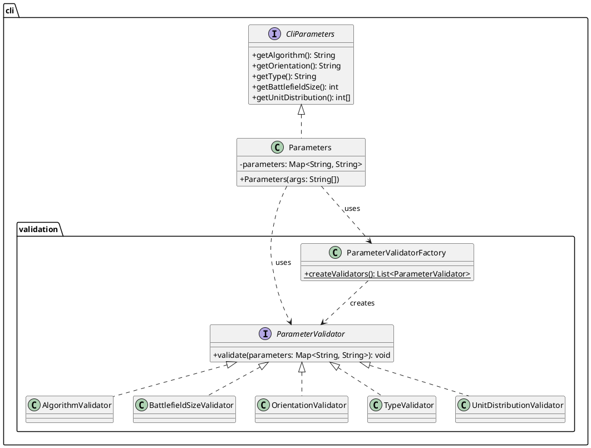
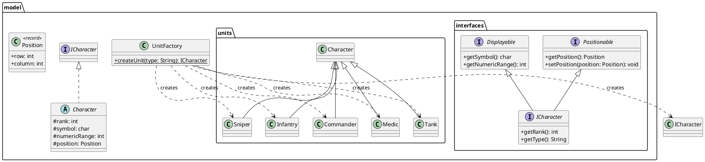
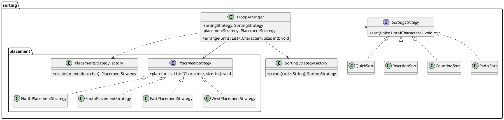
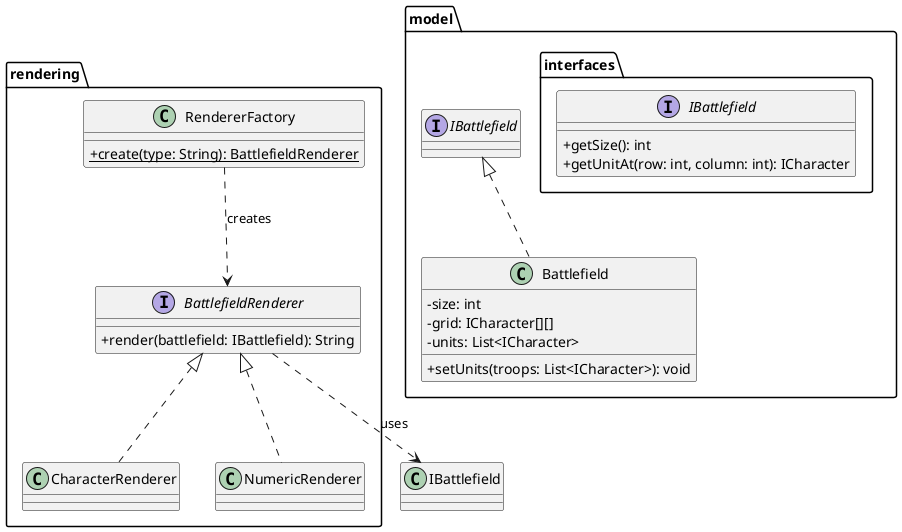

# Project Class Diagrams

This document contains the class diagrams for the **March of the Legion** project, illustrating its architecture based on SOLID principles.

---

## 1. CLI and Validation Architecture

This diagram shows how command-line parameters are parsed and validated. The design uses the **Strategy** and **Factory** patterns to create a flexible and extensible validation system, adhering to the **Single Responsibility Principle (SRP)** and the **Open/Closed Principle (OCP)**.

---

## 2. Domain Model Architecture

This diagram illustrates the core domain model. It follows the **Interface Segregation Principle (ISP)** by defining fine-grained interfaces (`Positionable`, `Displayable`) and the **Dependency Inversion Principle (DIP)** by ensuring that high-level components depend on the `ICharacter` abstraction, not on concrete unit classes. The **Factory Pattern** is used to decouple unit creation from the client.

---

## 3. Sorting and Placement Architecture

This diagram shows the orchestration of sorting and placement logic. The `TroopArranger` acts as a coordinator, using the **Strategy Pattern** for both sorting and placement. This design adheres to **SRP** by separating sorting from placement and **OCP** by allowing new algorithms to be added via factories without modifying the client code.

---

## 4. Battlefield and Rendering Architecture

This diagram illustrates the separation of battlefield state management from rendering. The `Battlefield` class implements the `IBattlefield` interface, which provides a read-only contract for the rendering components. This design follows **SRP** and **DIP**, as the renderers depend on an abstraction, not on the concrete `Battlefield` class.

